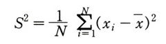
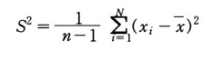

0. **분산(var, variance)** 이란,

    + 변수의 흩어진 정도를 계산하는 지표
    + 분산의 제곱근인 표준편차(sd, standard deviation)는, 
        - 어떤 변수 x에 관하여
        - 그 평균값를 중심으로 보았을 때,
        - 각 관측값이 평균적으로,
        - 어느 정도 평균값에서 벗어나 있는지를 계산한 것
        
    + 출처: [네이버 지식백과] 분산 [variance, 分散] (21세기 정치학대사전, 한국사전연구사)
    

1. Compare **Two** Variances
    * `F-Test`

2. Compare **Multiple** Sample Variances
	* `Bartlett’s test`
	* `Levene’s test`
	* `Fligner-Killeen test` (**non-parametric**)

