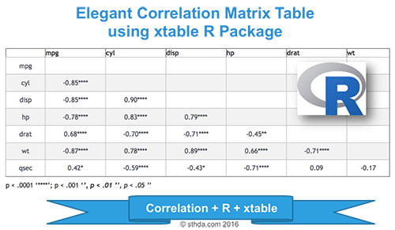

Correlation matrix analysis is an important method to find dependence between variables.  
The aim of this article is to show you how to get the lower and the upper triangular part of a correlation matrix.  
We will also use the xtable R package to display a nice correlation table in html or latex formats.

<!-- {width=600px} -->

(@) ###Correlation matrix analysis

+ The following R code computes a **correlation matrix** using `mtcars{datasets}` data.
+ The result is a table of **correlation coefficients** between **all possible pairs** of variables.

```{r code1, eval=TRUE, include=TRUE, echo=TRUE, message=FALSE, warning=FALSE}
( mcor <- round( cor(mtcars), 2) )
```


(@) ###Lower and upper triangular part of a correlation matrix

+ To get the lower or the upper part of a correlation matrix,
  the R function `lower.tri{base}` or `upper.tri{base}` can be used. The formats of the functions are :
  
```{r code2, eval=FALSE, include=TRUE, echo=TRUE, message=FALSE, warning=FALSE}
lower.tri(x, diag = FALSE)
upper.tri(x, diag = FALSE)
```

#
    - x     : is the correlation matrix
    - diag  : if TRUE, the diagonal are not included in the result.

+ The two functions above, return a matrix of logicals which has the same size of a the correlation matrix.  
  The entries is TRUE in the lower or upper triangle :
```{r code3, eval=TRUE, include=TRUE, echo=TRUE, message=FALSE, warning=FALSE}
upper.tri(mcor)

# Hide upper triangle
upper <- mcor
upper[ upper.tri(mcor) ] <- ""
( upper <- as.data.frame(upper) )

#Hide lower triangle
lower <- mcor
lower[ lower.tri(mcor, diag=TRUE) ] <- ""
( lower <- as.data.frame(lower) )
```

(@) ###Use xtable R package to display nice correlation table in html format

```{r code4, eval=TRUE, include=TRUE, echo=TRUE, message=TRUE, warning=FALSE}
# install.packages('xtable', dependencies = TRUE, quiet = TRUE)
library(xtable, quietly = TRUE)

# xtable(upper)
print( xtable(upper), type="html" )
```


(@) ###Combine matrix of correlation coefficients and significance levels

+ Custom function `corstars()` is used to combine the correlation coefficients and the level of significance.  
```{r code5, eval=TRUE, include=TRUE, echo=TRUE, message=FALSE, warning=FALSE}
# x is a matrix containing the data
# method : correlation method. "pearson"" or "spearman"" is supported
# removeTriangle : remove upper or lower triangle
# results :  if "html" or "latex"
  # the results will be displayed in html or latex format
corstars <-function(
              x,
              method=c("pearson", "spearman"),
              removeTriangle=c("upper", "lower"),
              result=c("none", "html", "latex")) {
  
    #Compute correlation matrix
    require(Hmisc)
  
    x <- as.matrix(x)
    
    correlation_matrix <- rcorr(x, type=method[1])
    
    R <- correlation_matrix$r # Matrix of correlation coeficients
    p <- correlation_matrix$P # Matrix of p-value 
    
    ## Define notions for significance levels; spacing is important.
    mystars <- ifelse(p < .0001, "****", ifelse(p < .001, "*** ", ifelse(p < .01, "**  ", ifelse(p < .05, "*   ", "    "))))
    
    ## trunctuate the correlation matrix to two decimal
    R <- format( round( cbind( rep(-1.11, ncol(x) ), R ), 2 ) )[,-1]
    
    ## build a new matrix that includes the correlations with their apropriate stars
    Rnew <- matrix( paste( R, mystars, sep="" ), ncol=ncol(x) )
    diag(Rnew) <- paste( diag(R), " ", sep="" )
    rownames(Rnew) <- colnames(x)
    colnames(Rnew) <- paste(colnames(x), "", sep="")
    
    ## remove upper triangle of correlation matrix
    if(removeTriangle[1]=="upper") {
      Rnew <- as.matrix(Rnew)
      Rnew[upper.tri(Rnew, diag = TRUE)] <- ""
      Rnew <- as.data.frame(Rnew)
    }
    
    ## remove lower triangle of correlation matrix
    else if(removeTriangle[1]=="lower") {
      Rnew <- as.matrix(Rnew)
      Rnew[lower.tri(Rnew, diag = TRUE)] <- ""
      Rnew <- as.data.frame(Rnew)
    }
    
    ## remove last column and return the correlation matrix
    Rnew <- cbind(Rnew[1:length(Rnew)-1])
    if (result[1]=="none") return(Rnew)
    else {
      if(result[1]=="html") print(xtable(Rnew), type="html")
      else print(xtable(Rnew), type="latex") 
    }
}
```

+ It requires 2 packages :
    - The `{Hmisc}` R package to compute the matrix of correlation coefficients and the corresponding p-values.
    - The `{xtable}` R package for displaying in HTML or Latex format.
    
```{r code6, eval=TRUE, include=TRUE, echo=TRUE, message=FALSE, warning=FALSE}
corstars(mtcars[,1:7], result="html")
```
    - p < .0001 ‘****’; p < .001 ‘***’, p < .01 ‘**’, p < .05 ‘*’


(@) ###Conclusions

+ Use `cor{stats}` function to compute correlation matrix.
+ Use `lower.tri{stats}` and `upper.tri{stats}` functions to get the lower or upper part of the correlation matrix
+ Use `{xtable}` R function to display a nice correlation matrix in latex or html format.