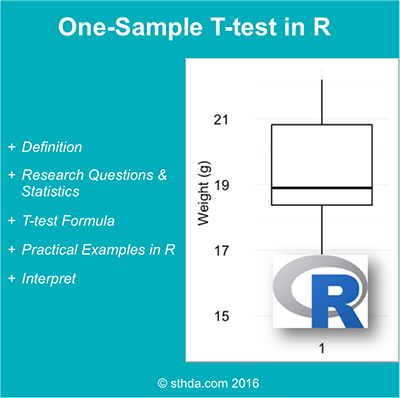

(@) ###What is one-sample t-test?

#
        one-sample t-test is used to compare the mean of one sample 
        to a known standard (or theoretical/hypothetical) mean (μ).

#
        Generally, the theoretical mean comes from:

        1. a previous experiment. 
            For example, compare whether the mean weight of mice differs from 200 mg, 
            a value determined in a previous study.
                       
        2. or from an experiment where you have control and treatment conditions. 
            If you express your data as “percent of control”, 
            you can test whether the average value of treatment condition differs significantly from 100.

#
        **Note** that, one-sample t-test can be used only, when the data are normally distributed.
        This can be checked using Shapiro-Wilk test
        
<!-- {width=400px} -->


(@) ###Research questions and statistical hypotheses

+ Typical research questions are:

#
        1. whether the mean (m) of the sample is equal to the theoretical mean (μ)?
        2. whether the mean (m) of the sample is less than the theoretical mean (μ)?
        3. whether the mean (m) of the sample is greater than the theoretical mean (μ)?

+ In statistics, we can define the corresponding `null hypothesis (H0)` as follow:

#
        1. H0 : m = μ
        2. H0 : m ≤ μ
        3. H0 : m ≥ μ
        
+ The corresponding `alternative hypotheses (H1)` are as follow:

#
        1. H1 : m ≠ μ (different)
        2. H1 : m > μ (greater)
        3. H1 : m < μ (less)

#
        **Note** that:

            Hypotheses 1) are called **two-tailed** tests
            Hypotheses 2) and 3) are called **one-tailed** tests


(@) ###Formula of one-sample t-test

+ The t-statistic can be calculated as follow :

$$t = \frac{m - μ}{\frac{s}{\sqrt{n}}}$$

#
        where,
            - m : the sample mean
            - n : the sample size
            - s : the sample standard deviation with n−1 degrees of freedom
            - μ : the theoretical value

+ We can compute the p-value corresponding to the absolute value of the t-test statistics (|t|) 
  for the degrees of freedom (df): df=n−1

+ How to interpret the results?

#
        If the p-value is inferior or equal to the significance level 0.05, 
        we can reject the null hypothesis and accept the alternative hypothesis. 
        
        In other words, we conclude that the sample mean is significantly different from the theoretical mean.


(@) ###Visualize your data and compute one-sample t-test in R

+ ####Install `{ggpubr}` R package for data visualization
You can draw `R base graps` as described at this link: `R base graphs`.  
Here, we’ll use the `{ggpubr}` R package for an easy `ggplot2-based` data visualization

```{r code1, eval=FALSE, include=TRUE, echo=TRUE, message=FALSE, warning=FALSE}
    install.packages("ggpubr", quiet = TRUE)
```


+ ####R function to compute `one-sample t-test`
To perform `one-sample t-test`, the R function `t.test{stats}` can be used as follow:

```{r code2, eval=FALSE, include=TRUE, echo=TRUE, message=FALSE, warning=FALSE}
    t.test(x, mu = 0, alternative = "two.sided")  # default: two-tailed test
```

#
        - x           : a numeric vector containing your data values
        - mu          : the theoretical mean. Default is 0 but you can change it.
        - alternative : the alternative hypothesis. 
                        Allowed value is one of “two.sided” (default), “greater” or “less”.


+ ####Import your data into R

Here, we’ll use an example data set containing the `weight of 10 mice`.  

We want to know, if the `average weight of the mice differs from 25g`?

```{r code3, eval=TRUE, include=TRUE, echo=TRUE, message=FALSE, warning=FALSE}
    set.seed(1234)

    ( my_data <- data.frame( name = paste0( rep("M_", 10), 1:10 ), weight = round( rnorm(10, 20, 2), 1 ) ) )
```


+ ####Check your data
```{r code4, eval=TRUE, include=TRUE, echo=TRUE, message=FALSE, warning=FALSE}
    # Print the random sampled, 10 rows of the data
    library(dplyr, quietly = TRUE)
    sample_n(tbl = my_data, size = 10, replace = FALSE)
    
    # Statistical summaries of weight
    summary(my_data$weight)
```

#
        - Min.    : the minimum value
        - 1st Qu. : The first quartile. 
                    25% of values are lower than this.
        - Median  : the median value. 
                    Half the values are lower; half are higher.
        - 3rd Qu. : the third quartile. 
                    75% of values are higher than this.
        - Max.    : the maximum value


+ ####Visualize your data using `box plots`

```{r code5, eval=TRUE, include=TRUE, echo=TRUE, message=FALSE, warning=FALSE}
    # install.packages('ggpubr', dependencies = TRUE)
    library(ggpubr, quietly = TRUE)

    ggboxplot(
          my_data$weight,
          ylab = "Weight (g)", 
          xlab = FALSE,
          ggtheme = theme_minimal()
      )
```


+ ####Preleminary test to check `one-sample t-test` assumptions

#
        1. Is this a large sample? - No, because n < 30.
        2. Since the sample size is not large enough (less than 30, central limit theorem), 
           we need to check whether the data follow a normal distribution.

#
        How to check the normality?

        Briefly, it’s possible to use the Shapiro-Wilk normality test and to look at the normality plot.

        (1) Shapiro-Wilk test
            a. Null hypothesis (H0)        : the data are *normally* distributed
            b. Alternative hypothesis (H1) : the data are *not* normally distributed
            
        (2) Visual inspection of the data normality using Q-Q plots (quantile-quantile plots). 
            Q-Q plot draws the correlation between a given sample and the normal distribution.


```{r code6, eval=TRUE, include=TRUE, echo=TRUE, message=FALSE, warning=FALSE}
    shapiro.test(my_data$weight)
```
#
        From the output, 
          1) the p-value is greater than the significance level 0.05 
             implying that the distribution of the data are not significantly different from normal distribtion. 
          2) In other words, we can assume the normality.

```{r code7, eval=TRUE, include=TRUE, echo=TRUE, message=FALSE, warning=FALSE}
    library("ggpubr", quietly = TRUE)

    ggqqplot(my_data$weight, ylab = "Men's weight", ggtheme = theme_minimal())
```

#
        From the normality plots, we conclude that the data may come from normal distributions.
        
        *Note* that, 
          if the data are not normally distributed, 
          it’s recommended to use the non parametric one-sample Wilcoxon rank test.


+ ####Compute `one-sample t-test`

#
        We want to know, if the average weight of the mice differs from 25g (two-tailed test)?

```{r code8, eval=TRUE, include=TRUE, echo=TRUE, message=FALSE, warning=FALSE}
    # One-sample t-test
    ( res <- t.test(my_data$weight, mu = 25) )
```

#
        In the result above :
          - t                 : the t-test statistic value (t = -9.078),
          - df                : the degrees of freedom (df= 9),
          - p-value           : the significance level of the t-test (p-value = 7.95310^{-6}).
          - conf.int          : the confidence interval of the mean at 95% (conf.int = [17.8172, 20.6828]);
          - sample estimates  : he mean value of the sample (mean = 19.25).

#
      *Note* that:
      
        1) if you want to test whether the mean weight of mice is less than 25g (one-tailed test), 
           type this:

```{r code9, eval=FALSE, include=TRUE, echo=TRUE, message=FALSE, warning=FALSE}
        t.test(my_data$weight, mu = 25, alternative = "less")
```

#
        2) Or, if you want to test whether the mean weight of mice is greater than 25g (one-tailed test),
           type this:

````{r code10, eval=FALSE, include=TRUE, echo=TRUE, message=FALSE, warning=FALSE}
        t.test(my_data$weight, mu = 25, alternative = "greater")
````


+ ####Interpretation of the result
#
    The `p-value` of the test is 7.95310^{-6}, which is `less than` the significance level `alpha = 0.05`. 
    We can conclude that the `mean weight` of the mice is `significantly different` from 25g 
    with a `p-value` = 7.95310^{-6}.


+ ####Access to the values returned by `t.test{stats}` function
#
    The result of `t.test{stats}` function is a **list** containing the following components:

#
    - statistic : the value of the t test statistics
    - parameter : the degrees of freedom for the t test statistics
    - p.value   : the p-value for the test
    - conf.int  : a confidence interval for the mean appropriate to the specified alternative hypothesis.
    - estimate  : the means of the two groups being compared (in the case of independent t test) 
                  or difference in means (in the case of paired t test).

The format of the R code to use for getting these values is as follow :

```{r}
    # printing the p-value
    res$p.value
    
    # printing the mean
    res$estimate
    
    # printing the confidence interval
    res$conf.int
```

