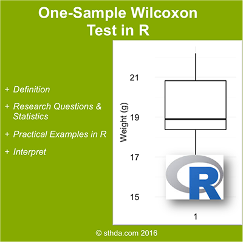

(@) ###What’s one-sample Wilcoxon signed rank test?
#
        The one-sample Wilcoxon signed rank test is a non-parametric alternative to one-sample t-test 
        when the data cannot be assumed to be normally distributed.
        
        It’s used to determine whether the median of the sample is equal to a known standard value
        (i.e. theoretical value).
+
#
        *Note* that, 
          1) the data should be distributed symmetrically around the median.
          2) In other words, there should be roughly the same number of values above and below the median.

    <!-- {width=400px} -->


(@) ###Research questions and statistical hypotheses

+ Typical research questions are:

#
        1) whether the median (m) of the sample is equal to the theoretical value (m0)?
        2) whether the median (m) of the sample is less than to the theoretical value (m0)?
        3) whether the median (m) of the sample is greater than to the theoretical value(m0)?

+ In statistics, we can define the corresponding null hypothesis (H0) as follow:

#
        H0 : m = m0
        H0 : m ≤ m0
        H0 : m ≥ m0

+ The corresponding alternative hypotheses (H1) are as follow:

#
        H1 : m ≠ m0 (different)
        H1 : m > m0 (greater)
        H1 : m < m0 (less)

#
    *Note* that:
  
      Hypotheses 1) are called two-tailed tests
      Hypotheses 2) and 3) are called one-tailed tests


(@) ###Visualize your data and compute one-sample Wilcoxon test in R

+ Install ggpubr R package for data visualization
    - You can draw R base graphs as described at this link: R base graphs.
    - Here, we’ll use the ggpubr R package for an easy ggplot2-based data visualization

```{r code1, eval=FALSE, include=TRUE, echo=TRUE, message=FALSE, warning=FALSE}
    install.packages("ggpubr")
```

+ R function to compute one-sample Wilcoxon test
    - To perform one-sample Wilcoxon-test, 
      the R function wilcox.test() can be used as follow:

```{r code2, eval=FALSE, include=TRUE, echo=TRUE, message=FALSE, warning=FALSE}
    wilcox.test(x, mu = 0, alternative = "two.sided")
```

#
        - x           : a numeric vector containing your data values
        - mu          : the theoretical mean/median value.
                        Default is 0 but you can change it.
        - alternative : the alternative hypothesis. 
                        Allowed value is one of “two.sided” (default), “greater” or “less”.


+ Import your data into R
    - Here, we’ll use an example data set containing the weight of 10 mice.

#
        We want to know, if the median weight of the mice differs from 25g?

```{r code3, eval=TRUE, include=TRUE, echo=TRUE, message=FALSE, warning=FALSE}
    set.seed(1234)

    ( my_data <- data.frame( 
                    name = paste0(rep("M_", 10), 1:10),
                    weight = round(rnorm(10, 20, 2), 1)
      ) )
```


+ Check your data

```{r code4, eval=TRUE, include=TRUE, echo=TRUE, message=FALSE, warning=FALSE}
    # Print the random sampled 10 rows of the data
    library(dplyr)
    sample_n(tbl = my_data, size = 10, replace = FALSE)
    
    # Statistical summaries of weight
    summary(my_data$weight)
```

#
        - Min.  : the minimum value
        - 1st Qu. : The first quartile. 25% of values are lower than this.
        - Median  : the median value. Half the values are lower; half are higher.
        - 3rd Qu. : the third quartile. 75% of values are higher than this.
        - Max.    : the maximum value


+ Visualize your data using box plots

```{r code5, eval=TRUE, include=TRUE, echo=TRUE, message=FALSE, warning=FALSE}
    library(ggpubr)

    ggboxplot(my_data$weight, 
              ylab = "Weight (g)", 
              xlab = FALSE,
              ggtheme = theme_minimal())
```


+ Compute one-sample Wilcoxon test

#
        We want to know, if the average weight of the mice differs from 25g (two-tailed test)?

```{r code6, eval=TRUE, include=TRUE, echo=TRUE, message=FALSE, warning=FALSE}
    # One-sample wilcoxon test
    ( res <- wilcox.test(my_data$weight, mu = 25) )

    # print only the p-value
    res$p.value
```

#
        The p-value of the test is 0.005793, which is less than the significance level alpha = 0.05.
        We can reject the null hypothesis and conclude that the average weight of the mice is 
        significantly different from 25g with a p-value = 0.005793.


#### Note that:

        1) if you want to test whether the median weight of mice is less than 25g (one-tailed test), 
           type this :

```{r code7, eval=TRUE, include=TRUE, echo=TRUE, message=FALSE, warning=FALSE}
    wilcox.test(my_data$weight, mu = 25, alternative = "less")
```

        2) Or, if you want to test whether the median weight of mice is greater than 25g (one-tailed test),
           type this :
        
```{r code8, eval=TRUE, include=TRUE, echo=TRUE, message=FALSE, warning=FALSE}
    wilcox.test(my_data$weight, mu = 25, alternative = "greater")
```

