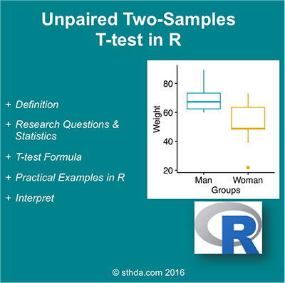

##This article describes the formula of the independent t-test

(@) ###What is unpaired two-samples t-test?

#
      The unpaired two-samples t-test is used to compare the mean of two independent groups.

For example, suppose that we have measured the weight of 100 individuals: 50 women (group A) and 50 men (group B).
We want to know if the mean weight of women (m~A~) is significantly different from that of men (m~B~).

In this case, we have two unrelated (i.e., independent or unpaired) groups of samples. 
Therefore, it’s possible to use an independent t-test to evaluate whether the means are different.

#
      *Note* that,
      
        unpaired two-samples t-test can be used only under certain conditions:
  
          1) when the two groups of samples (A and B), being compared, are normally distributed,
             This can be checked using Shapiro-Wilk test.
          2) and when the variances of the two groups are equal, 
             This can be checked using F-test.

<!-- {width=400px} -->


(@) ###Research questions and statistical hypotheses

+ Typical research questions are :
    1) whether the mean of group A (m~A~) is equal to the mean of group B (m~B~)?
    2) whether the mean of group A (m~A~) is less than the mean of group B (m~B~)?
    3) whether the mean of group A (m~A~) is greather than the mean of group B (m~B~)?
<p/>

+ In statistics, we can define the corresponding null hypothesis (H0) as follow:
    1. H0 : m~A~ = m~B~
    2. H0 : m~A~ ≤ m~B~
    3. H0 : m~A~ ≥ m~B~
<p/>

+ The corresponding alternative hypotheses (H1) are as follow:
    1. H1 : m~A~ ≠ m~B~ (different)
    2. H1 : m~A~ > m~B~ (greater)
    3. H1 : m~A~ < m~B~ (less)

#
    *Note* that:
  
      Hypotheses 1) are called two-tailed tests
      Hypotheses 2) and 3) are called one-tailed tests


(@) ###Formula of unpaired two-samples t-test

+ ####Classical t-test :

#
      If the variance of the two groups are equivalent (homoscedasticity), 
      the t-test value, comparing the two samples (A and B), can be calculated as follow.

  $$t = \frac{m_A - m_B}{\sqrt{\frac{s^2}{n_A} + \frac{s^2}{n_B}}}$$

#
      where,
        mA and mB represent the mean value of the group A and B, respectively.
        nA and nB represent the sizes of the group A and B, respectively.
        S2 is an estimator of the pooled variance of the two groups. It can be calculated as follow :

  $$S^2 = \frac{\sum{(x - m_A)^2} + \sum{(x - m_B)^2}}{n_A + n_B - 2}$$

with degrees of freedom (df): df=nA+nB−2
<p/><p/>

+ ####Welch t-statistic : 

#
      If the variances of the two groups being compared are different (heteroscedasticity), 
      it’s possible to use the Welch t test, an adaptation of Student t-test.

#####a. Welch t-statistic is calculated as follow :

  $$t = \frac{m_A - m_B}{\sqrt{\frac{s^2}{n_A} + \frac{s^2}{n_B}}}$$

  where, SA and SB are the standard deviation of the the two groups A and B, respectively.

  Unlike the classic Student’s t-test,  
  Welch t-test formula involves the variance of each of the two groups ($S^2_A$ and $S^2_B$) being compared.  
  In other words, it does not use the pooled variance, S

#####b. The degrees of freedom of Welch t-test is estimated as follow :

  $$df = \frac{(\frac{s^2_A}{n_A} + \frac{s^2_B}{n^2_B})}{(\frac{s^4_A}{n^2_A(n_B - 1)} + \frac{s^4_B}{n^2_B(n_B - 1)})}$$

#
      A p-value can be computed for the corresponding absolute value of t-statistic (|t|).

#
      Note that, the Welch t-test is considered as the safer one.
      Usually, the results of the classical t-test and the Welch t-test are very similar unless
      both the group sizes and the standard deviations are very different.

#####c. How to interpret the results?

#
      If the p-value is inferior or equal to the significance level 0.05,
      we can reject the null hypothesis and accept the alternative hypothesis.
      In other words, we can conclude that the mean values of group A and B are significantly different.


(@) ###Visualize your data and compute unpaired two-samples t-test in R

+ ####Install ggpubr R package for data visualization

```{r code1, eval=FALSE, include=TRUE, echo=TRUE, message=FALSE, warning=FALSE}
    install.packages("ggpubr")
```

+ ####R function to compute unpaired two-samples t-test

  To perform two-samples t-test comparing the means of two independent samples (x & y),  
  the R function t.test() can be used as follow:

```{r code2, eval=FALSE, include=TRUE, echo=TRUE, message=FALSE, warning=FALSE}
    t.test(x, y, alternative = "two.sided", var.equal = FALSE)
```

#
      - x,y         : numeric vectors
      - alternative : the alternative hypothesis.
                      Allowed value is one of “two.sided” (default), “greater” or “less”.
      - var.equal   : a logical variable indicating whether to treat the two variances as being equal.
                      If TRUE, then the pooled variance is used to estimate the variance.
                      otherwise the Welch test is used.


+ ####Import your data into R

Here, we’ll use an example data set, which contains the weight of 18 individuals (9 women and 9 men):

```{r code3, eval=TRUE, include=TRUE, echo=TRUE, message=FALSE, warning=FALSE}
    # Data in two numeric vectors
    women_weight <- c(38.9, 61.2, 73.3, 21.8, 63.4, 64.6, 48.4, 48.8, 48.5)
    men_weight <- c(67.8, 60, 63.4, 76, 89.4, 73.3, 67.3, 61.3, 62.4)
    
    # Create a data frame
    ( my_data <- data.frame( 
                    group = rep(c("Woman", "Man"), each = 9),
                    weight = c(women_weight,  men_weight)
                  ) )
```

#
        We want to know, if the average women’s weight differs from the average men’s weight?


+ ####Check your data

```{r code4, eval=TRUE, include=TRUE, echo=TRUE, message=FALSE, warning=FALSE}
    # Print all data

    #library(knitr, quietly = TRUE)
    #kable(x = my_data, caption = 'All Data displayed :')

    print(my_data)
```

#
      It’s possible to compute summary statistics (mean and sd) by groups. 
      The {dplyr} package can be used.

a. To install dplyr package, type this :

```{r code5, eval=FALSE, include=TRUE, echo=TRUE, message=FALSE, warning=FALSE}
    install.packages("dplyr")
```

b. Compute summary statistics by groups :

```{r code6, eval=TRUE, include=TRUE, echo=TRUE, message=FALSE, warning=FALSE}
    library(dplyr, quietly = TRUE)

    group_by(my_data, group) %>%
      summarise(
        count = n(),
        mean = mean(weight, na.rm = TRUE),
        sd = sd(weight, na.rm = TRUE)
      )
```


+ ####Visualize your data using box plots

```{r eval=TRUE, include=TRUE, echo=TRUE, message=FALSE, warning=FALSE}
    # Plot weight by group and color by group
    library("ggpubr")

    ggboxplot(my_data, x = "group", y = "weight", 
              color = "group", palette = c("#00AFBB", "#E7B800"),
            ylab = "Weight", xlab = "Groups")
```

+ ####Preleminary test to check independent t-test assumptions

#
      Assumption 1: Are the two samples independents?
      
Answer 1: Yes, since the samples from men and women are not related.

#
      Assumtion 2: Are the data from each of the 2 groups follow a normal distribution?

Answer 2: Use Shapiro-Wilk normality test

#
      1) Null hypothesis        : the data are normally distributed  
      2) Alternative hypothesis : the data are not normally distributed  

We’ll use the functions `with()` and `shapiro.test()` to compute Shapiro-Wilk test  
for each group of samples.

```{r eval=TRUE, include=TRUE, echo=TRUE, message=FALSE, warning=FALSE}
    # Shapiro-Wilk normality test for Men's weights
    with(my_data, shapiro.test(weight[group == "Man"]))# p = 0.1

    # Shapiro-Wilk normality test for Women's weights
    with(my_data, shapiro.test(weight[group == "Woman"])) # p = 0.6
```

#
      From the output, 
        the two p-values are greater than the significance level 0.05 implying that 
        the distribution of the data are not significantly different from the normal distribution. 
        In other words, we can assume the normality.

#
      Note that,
        if the data are not normally distributed, 
        it’s recommended to use the non parametric two-samples Wilcoxon rank test.

#
      Assumption 3 : Do the two populations have the same variances?

We’ll use `F-test` to test for homogeneity in variances.  
This can be performed with the function `var.test()` as follow:

```{r eval=TRUE, include=TRUE, echo=TRUE, message=FALSE, warning=FALSE}
    ( res.ftest <- var.test(weight ~ group, data = my_data) )
```

#
      The p-value of F-test is p = 0.1713596. 
      It’s greater than the significance level alpha = 0.05. 
      In conclusion, there is no significant difference between the variances of the two sets of data. 
      Therefore, we can use the classic t-test witch assume equality of the two variances.

+ ####Compute unpaired two-samples t-test

#
      Question : Is there any significant difference between women and men weights?

1) Compute independent t-test  
    - Method 1: The data are saved in two different numeric vectors.

```{r eval=TRUE, include=TRUE, echo=TRUE, message=FALSE, warning=FALSE}
    # Compute t-test
    ( res <- t.test(women_weight, men_weight, var.equal = TRUE) )
```

2) Compute independent t-test  
    - Method 2: The data are saved in a data frame.

```{r eval=TRUE, include=TRUE, echo=TRUE, message=FALSE, warning=FALSE}
    # Compute t-test
    ( res <- t.test(weight ~ group, data = my_data, var.equal = TRUE) )
```

#
    As you can see, the two methods give the same results.
    
#
    In the result above :
        - t : the t-test statistic value (t = 2.784),
        - df : the degrees of freedom (df= 16),
        - p-value : the significance level of the t-test (p-value = 0.01327).
        - conf.int : the confidence interval of the mean at 95% (conf.int = [4.0298, 29.748]);
        - sample estimates : he mean value of the sample (mean = 68.9888889, 52.1).


#### Note that:

        1) if you want to test whether the average men’s weight is less than the average women’s weight, 
           type this:

```{r eval=TRUE, include=TRUE, echo=TRUE, message=FALSE, warning=FALSE}
    t.test(weight ~ group, data = my_data, var.equal = TRUE, alternative = "less")
```

        2) Or, if you want to test whether the average men’s weight is greater than the average women’s weight,
          type this :
        
```{r eval=TRUE, include=TRUE, echo=TRUE, message=FALSE, warning=FALSE}
    t.test(weight ~ group, data = my_data, var.equal = TRUE, alternative = "greater")
```


+ ####Interpretation of the result

#
      The p-value of the test is 0.01327, which is less than the significance level alpha = 0.05.
      We can conclude that men’s average weight is significantly different from women’s average weight
      with a p-value = 0.01327.


+ ####Access to the values returned by `t.test()` function

The result of `t.test()` function is a list containing the following components :

#
      1. statistic : the value of the t test statistics
      2. parameter : the degrees of freedom for the t test statistics
      3. p.value   : the p-value for the test
      4. conf.int  : a confidence interval for the mean appropriate to the specified alternative hypothesis.
      5. estimate  : the means of the two groups being compared (in the case of independent t test) 
                     or difference in means (in the case of paired t test).

The format of the R code to use for getting these values is as follow :

```{r eval=TRUE, include=TRUE, echo=TRUE, message=FALSE, warning=FALSE}
    # printing the p-value
    res$p.value

    # printing the mean
    res$estimate
    
    # printing the confidence interval
    res$conf.int
```

