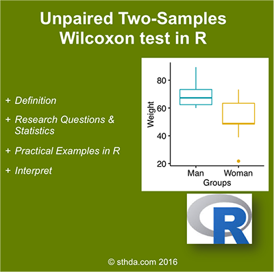

#
    The unpaired two-samples Wilcoxon test (also known as Wilcoxon rank sum test or Mann-Whitney test) 
    is a non-parametric alternative to the unpaired two-samples t-test, 
    which can be used to compare two independent groups of samples. 
    
    It’s used when your data are not normally distributed.

<!-- {width=400px} -->


(@) ###Visualize your data and compute Wilcoxon test

+ ####R function to compute Wilcoxon test

To perform two-samples Wilcoxon test comparing the means of two independent samples (x & y),  
the R function wilcox.test() can be used as follow :

```{r eval=FALSE, include=TRUE, echo=TRUE, message=FALSE, warning=FALSE}
  wilcox.test(x, y, alternative = "two.sided")
```

#
      - x, y        : numeric vectors
      - alternative : the alternative hypothesis. 
                      Allowed value is one of “two.sided” (default), “greater” or “less”.


+ ####Import your data into R

Here, we’ll use an example data set, 
which contains the weight of 18 individuals (9 women and 9 men) :

```{r eval=TRUE, include=TRUE, echo=TRUE, message=FALSE, warning=FALSE}
  # Data in two numeric vectors
  women_weight <- c(38.9, 61.2, 73.3, 21.8, 63.4, 64.6, 48.4, 48.8, 48.5)
  men_weight <- c(67.8, 60, 63.4, 76, 89.4, 73.3, 67.3, 61.3, 62.4)
  
  # Create a data frame
  ( my_data <- data.frame( 
                  group = rep(c("Woman", "Man"), each = 9),
                  weight = c(women_weight,  men_weight)
              ) )
```

#
      We want to know, if the median women’s weight differs from the median men’s weight?


+ ####Check your data

```{r eval=TRUE, include=TRUE, echo=TRUE, message=FALSE, warning=FALSE}
  print(my_data)
```

#
      It’s possible to compute summary statistics (median and interquartile range (IQR)) by groups. 
      The {dplyr} package can be used.

Compute summary statistics by groups :

```{r eval=TRUE, include=TRUE, echo=TRUE, message=FALSE, warning=FALSE}
  library(dplyr)

  group_by(my_data, group) %>%
            summarise(
              count = n(),
              median = median(weight, na.rm = TRUE),
              IQR = IQR(weight, na.rm = TRUE)
            )
```


+ ####Visualize your data using box plots

You can draw R base graphs as described at this link : R base graphs.  
Here, we’ll use the {ggpubr} R package for an easy ggplot2-based data visualization

```{r eval=TRUE, include=TRUE, echo=TRUE, message=FALSE, warning=FALSE}
  # Plot weight by group and color by group
  library("ggpubr")

  ggboxplot(
          my_data, 
          x = "group", 
          y = "weight", 
          color = "group", 
          palette = c("#00AFBB", "#E7B800"),
          ylab = "Weight", 
          xlab = "Groups"
      )
```


+ ####Compute unpaired two-samples Wilcoxon test

#
      Question : Is there any significant difference between women and men weights?

1) Compute two-samples Wilcoxon test
    - Method 1 : The data are saved in two different numeric vectors.

```{r eval=TRUE, include=TRUE, echo=TRUE, message=FALSE, warning=FALSE}
  ( res <- wilcox.test(women_weight, men_weight) )
```

#
      It will give a warning message, saying that “cannot compute exact p-value with tie”.
      It comes from the assumption of a Wilcoxon test that the responses are continuous.
      You can suppress this message by adding another argument exact = FALSE, but the result will be the same.


2) Compute two-samples Wilcoxon test
    - Method 2: The data are saved in a data frame.

```{r eval=TRUE, include=TRUE, echo=TRUE, message=FALSE, warning=FALSE}
  ( res <- wilcox.test(weight ~ group, data = my_data, exact = FALSE) )

  # Print the p-value only
  res$p.value
```

#
      As you can see, the two methods give the same results.

#
      The p-value of the test is 0.02712, which is less than the significance level alpha = 0.05.
      We can conclude that men’s median weight is significantly different from women’s median weight
      with a p-value = 0.02712.


#### Note that:

        1) if you want to test whether the median men’s weight is less than the median women’s weight,
           type this :

```{r eval=TRUE, include=TRUE, echo=TRUE, message=FALSE, warning=FALSE}
    wilcox.test(weight ~ group, data = my_data, exact = FALSE, alternative = "less")
```

        2) Or, if you want to test whether the median men’s weight is greater than the median women’s weight,
           type this :
        
```{r eval=TRUE, include=TRUE, echo=TRUE, message=FALSE, warning=FALSE}
    wilcox.test(weight ~ group, data = my_data, exact = FALSE, alternative = "greater")
```

