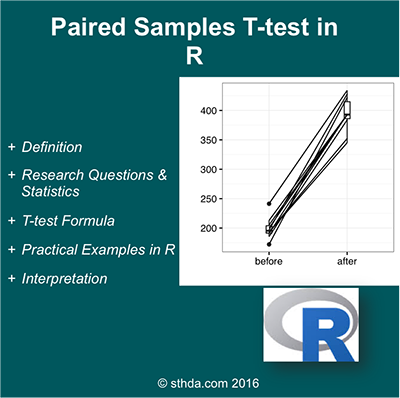

(@) ###What is paired samples t-test?

#
      The paired samples t-test is used to compare the means between two related groups of samples.
      In this case, you have two values (i.e., pair of values) for the same samples.
      This article describes how to compute paired samples t-test using R software.

As an example of data, 20 mice received a treatment X during 3 months.  
We want to know whether the treatment X has an impact on the weight of the mice.

To answer to this question, the weight of the 20 mice has been measured before and after the treatment.  
This gives us 20 sets of values before treatment and 20 sets of values after treatment 
from measuring twice the weight of the same mice.

In such situations, paired t-test can be used to compare the mean weights before and after treatment.

Paired t-test analysis is performed as follow:

    1. Calculate the difference (d) between each pair of value
    2. Compute the mean (m) and the standard deviation (s) of d
    3. Compare the average difference to 0.  
       If there is any significant difference between the two pairs of samples,
       then the mean of d (m) is expected to be far from 0.

#
      Paired t-test can be used only when the difference d is normally distributed.
      This can be checked using Shapiro-Wilk test.

<!-- {width=400px} -->

(@) ###Research questions and statistical hypotheses

Typical research questions are:

      1. whether the mean difference (m) is equal to 0?
      2. whether the mean difference (m) is less than 0?
      3. whether the mean difference (m) is greather than 0?

In statistics, 

  we can define the corresponding null hypothesis (H0) as follow:

      1. H0 : m = 0
      2. H0 : m ≤ 0
      3. H0 : m ≥ 0
    
  The corresponding alternative hypotheses (H1) are as follow:

      1. H1 : m ≠ 0 (different)
      2. H1 : m > 0 (greater)
      3. H1 : m < 0 (less)

#
      *Note* that:

          Hypotheses 1) are called two-tailed tests
          Hypotheses 2) and 3) are called one-tailed tests


(@) ###Formula of paired samples t-test

t-test statistisc value can be calculated using the following formula :

$$t = \frac{m}{\frac{s}{\sqrt{n}}}$$

      where,
        - m : the mean differences
        - n : the sample size (i.e., size of d).
        - s : the standard deviation of d


We can compute the p-value corresponding to the absolute value of the t-test statistics (|t|)
for the degrees of freedom (df): df=n−1

      If the p-value is inferior or equal to 0.05, 
      we can conclude that the difference between the two paired samples are significantly different.

(@) ###Visualize your data and compute paired t-test in R

+ #####R function to compute paired t-test

To perform paired samples t-test comparing the means of two paired samples (x & y),  
the R function t.test() can be used as follow : 

```{r eval=FALSE, include=TRUE, echo=TRUE, message=FALSE, warning=FALSE}
    t.test(x, y, paired = TRUE, alternative = "two.sided")
```

      - x,y         : numeric vectors
      - paired      : a logical value specifying that we want to compute a paired t-test
      - alternative : the alternative hypothesis.
                      Allowed value is one of “two.sided” (default), “greater” or “less”.


+ #####Import your data into R

Here, we’ll use an example data set, which contains the weight of 10 mice before and after the treatment.

```{r eval=TRUE, include=TRUE, echo=TRUE, message=FALSE, warning=FALSE}
    # Data in two numeric vectors
    # ++++++++++++++++++++++++++

    # Weight of the mice before treatment
    before <-c(200.1, 190.9, 192.7, 213, 241.4, 196.9, 172.2, 185.5, 205.2, 193.7)

    # Weight of the mice after treatment
    after <-c(392.9, 393.2, 345.1, 393, 434, 427.9, 422, 383.9, 392.3, 352.2)
    
    # Create a data frame
    my_data <- data.frame( 
                    group = rep(c("before", "after"), each = 10),
                    weight = c(before,  after)
                  )
```

      We want to know, if there is any significant difference in the mean weights after treatment?


+ #####Check your data

```{r eval=TRUE, include=TRUE, echo=TRUE, message=FALSE, warning=FALSE}
    # Print all data
    print(my_data)
```

Compute summary statistics (mean and sd) by groups using the dplyr package.

```{r eval=TRUE, include=TRUE, echo=TRUE, message=FALSE, warning=FALSE}
    library("dplyr", quietly = TRUE)

    group_by(my_data, group) %>%
        summarise(
            count = n(),
            mean = mean(weight, na.rm = TRUE),
            sd = sd(weight, na.rm = TRUE)
        )
```


+ #####Visualize your data using box plots

To use R base graphs read this: R base graphs.  
Here, we’ll use the ggpubr R package for an easy ggplot2-based data visualization.

```{r eval=TRUE, include=TRUE, echo=TRUE, message=FALSE, warning=FALSE}
    # Plot weight by group and color by group
    library("ggpubr")

    ggboxplot(my_data, 
              x = "group",
              y = "weight", 
              color = "group",
              palette = c("#00AFBB", "#E7B800"),
              order = c("before", "after"),
              ylab = "Weight",
              xlab = "Groups")
```

Box plots show you the increase, but lose the paired information.  
You can use the function `plot.paired{pairedData}` to plot paired data (“before - after” plot).

```{r eval=TRUE, include=TRUE, echo=TRUE, message=FALSE, warning=FALSE}
    #install.packages("PairedData", quiet = TRUE, dependencies = TRUE)

    # Subset weight data before treatment
    before <- subset(my_data,  group == "before", weight, drop = TRUE)
    
    # subset weight data after treatment
    after <- subset(my_data,  group == "after", weight, drop = TRUE)
    
    # Plot paired data
    library(PairedData)
    
    pd <- paired(before, after)
    plot(pd, type = "profile") + theme_bw()
```


+ #####Preleminary test to check paired t-test assumptions

#
      Assumption 1: Are the two samples paired?

Yes, since the data have been collected from measuring twice the weight of the same mice.

#
      Assumption 2: Is this a large sample?

No, because n < 30. Since the sample size is not large enough (less than 30),
we need to check whether the differences of the pairs follow a normal distribution.

#
      How to check the normality?

      Use Shapiro-Wilk normality test

        1) Null hypothesis        : the data are normally distributed
        2) Alternative hypothesis : the data are not normally distributed

```{r eval=TRUE, include=TRUE, echo=TRUE, message=FALSE, warning=FALSE}
  # compute the difference
  d <- with(my_data, weight[group == "before"] - weight[group == "after"])

  # Shapiro-Wilk normality test for the differences
  shapiro.test(d) # => p-value = 0.6141
```

#
      From the output, 
        the p-value is greater than the significance level 0.05 implying 
        that the distribution of the differences (d) are not significantly different from normal distribution.
        
      In other words, we can assume the normality.

#
      *Note* that,
        if the data are not normally distributed, 
        it’s recommended to use the non parametric paired two-samples Wilcoxon test.


+ #####Compute paired samples t-test

#
      Question : Is there any significant changes in the weights of mice after treatment?

1) Compute paired t-test
    - Method 1: The data are saved in two different numeric vectors.

```{r eval=TRUE, include=TRUE, echo=TRUE, message=FALSE, warning=FALSE}
  # Compute t-test
  ( res <- t.test(before, after, paired = TRUE) )
```


2) Compute paired t-test
    - Method 2: The data are saved in a data frame.

```{r}
  # Compute t-test
  ( res <- t.test(weight ~ group, data = my_data, paired = TRUE) )
```

#
      As you can see, the two methods give the same results.

#
      In the result above :
        - t         : the t-test statistic value (t = 20.88),
        - df        : the degrees of freedom (df= 9),
        - p-value   : the significance level of the t-test (p-value = 6.210^{-9}).
        - conf.int  : the confidence interval (conf.int) of the mean differences at 95%
                      is also shown (conf.int= [173.42, 215.56])
        - sample estimates : the mean differences between pairs (mean = 194.49).


#### Note that:

        1) if you want to test whether the average weight
           before treatment is less than the average weight after treatment,
           type this : 

```{r eval=TRUE, include=TRUE, echo=TRUE, message=FALSE, warning=FALSE}
    t.test(weight ~ group, data = my_data, paired = TRUE, alternative = "less")
```

        2) Or, if you want to test whether the average weight
           before treatment is greater than the average weight after treatment,
           type this : 

```{r eval=TRUE, include=TRUE, echo=TRUE, message=FALSE, warning=FALSE}
    t.test(weight ~ group, data = my_data, paired = TRUE, alternative = "greater")
```


+ #####Interpretation of the result

#
      The p-value of the test is 6.210^{-9}, which is less than the significance level alpha = 0.05.
      We can then reject null hypothesis and conclude that the average weight of the mice 
      before treatment is significantly different from the average weight
      after treatment with a p-value = 6.210^{-9}.


+ #####Access to the values returned by t.test() function

The result of t.test() function is a list containing the following components :

#
      a. statistic  : the value of the t test statistics
      b. parameter  : the degrees of freedom for the t test statistics
      c. p.value    : the p-value for the test
      d. conf.int   : a confidence interval for the mean appropriate to the specified alternative hypothesis.
      e. estimate   : the means of the two groups being compared (in the case of independent t test) 
                      or difference in means (in the case of paired t test).

The format of the R code to use for getting these values is as follow :

```{r eval=TRUE, include=TRUE, echo=TRUE, message=FALSE, warning=FALSE}
  # printing the p-value
  res$p.value

  # printing the mean
  res$estimate
  
  # printing the confidence interval
  res$conf.int
```


