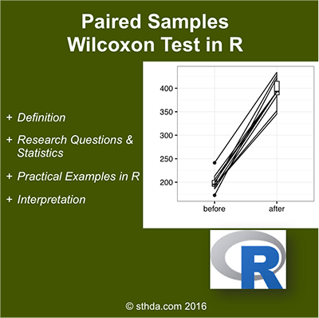

##The paired samples Wilcoxon test (also known as Wilcoxon signed-rank test) is a non-parametric alternative to paired t-test used to compare paired data.

##It’s used when your data are not normally distributed.

#
    Differences between paired samples should be distributed symmetrically around the median.

<!-- {width=400px} -->


(@) ###Visualize your data and compute paired samples Wilcoxon test

+ ####R function

The R function wilcox.test() can be used as follow :

```{r eval=FALSE, include=TRUE, echo=TRUE, message=FALSE, warning=FALSE}
  wilcox.test(x, y, paired = TRUE, alternative = "two.sided")
```

#
      x, y        : numeric vectors
      paired      : a logical value specifying that we want to compute a paired Wilcoxon test
      alternative : the alternative hypothesis.
                    Allowed value is one of “two.sided” (default), “greater” or “less”.


+ ####Import your data into R

Here, we’ll use an example data set, which contains the weight of 10 mice 
before and after the treatment.

```{r eval=TRUE, include=TRUE, echo=TRUE, message=FALSE, warning=FALSE}
  # Data in two numeric vectors
  # ++++++++++++++++++++++++++

  # Weight of the mice before treatment
  before <-c(200.1, 190.9, 192.7, 213, 241.4, 196.9, 172.2, 185.5, 205.2, 193.7)

  # Weight of the mice after treatment
  after <-c(392.9, 393.2, 345.1, 393, 434, 427.9, 422, 383.9, 392.3, 352.2)
  
  # Create a data frame
  my_data <- data.frame( 
                  group = rep(c("before", "after"), each = 10),
                  weight = c(before,  after)
                )
```

#
      We want to know, 
        if there is any significant difference in the median weights 
        before and after treatment?


+ ####Check your data

```{r eval=TRUE, include=TRUE, echo=TRUE, message=FALSE, warning=FALSE}
  # Print all data
  print(my_data)
```

Compute summary statistics (median and inter-quartile range (IQR)) 
by groups using the dplyr package can be used.

```{r eval=TRUE, include=TRUE, echo=TRUE, message=FALSE, warning=FALSE}
  library("dplyr")

  group_by(my_data, group) %>%
      summarise(
          count = n(),
          median = median(weight, na.rm = TRUE),
          IQR = IQR(weight, na.rm = TRUE)
      )
```


+ ####Visualize your data using box plots

```{r eval=TRUE, include=TRUE, echo=TRUE, message=FALSE, warning=FALSE}
  # Plot weight by group and color by group
  library("ggpubr")
  
  ggboxplot(my_data, 
            x = "group", 
            y = "weight", 
            color = "group", 
            palette = c("#00AFBB", "#E7B800"),
            order = c("before", "after"),
            ylab = "Weight", 
            xlab = "Groups"
          )
```

#
      Box plots show you the increase, but lose the paired information.
      You can use the function plot.paired{pairedData} to plot paired data (“before - after” plot).

1) Install pairedData package :

```{r eval=FALSE, include=TRUE, echo=TRUE, message=FALSE, warning=FALSE}
  install.packages("PairedData", quiet = TRUE, dependencies = TRUE)
```

2) Plot paired data :

```{r eval=TRUE, include=TRUE, echo=TRUE, message=FALSE, warning=FALSE}
  # Subset weight data before treatment
  before <- subset(my_data,  group == "before", weight, drop = TRUE)

  # subset weight data after treatment
  after <- subset(my_data,  group == "after", weight, drop = TRUE)
  
  # Plot paired data
  library(PairedData, quietly = TRUE)
  
  pd <- paired(before, after)
  plot(pd, type = "profile") + theme_bw()
```


+ ####Compute paired-sample Wilcoxon test

#
      Question : Is there any significant changes in the weights of mice before after treatment?

1) Compute paired Wilcoxon test
    - Method 1 : The data are saved in two different numeric vectors

```{r eval=TRUE, include=TRUE, echo=TRUE, message=FALSE, warning=FALSE}
  ( res <- wilcox.test(before, after, paired = TRUE) )
```

2) Compute paired Wilcoxon-test
    - Method 2 : The data are saved in a data frame

```{r eval=TRUE, include=TRUE, echo=TRUE, message=FALSE, warning=FALSE}
  # Compute t-test
  ( res <- wilcox.test(weight ~ group, data = my_data, paired = TRUE) )

  # print only the p-value
  res$p.value
```

#
      As you can see, the two methods give the same results.
    
#
      The p-value of the test is 0.001953, which is less than the significance level alpha = 0.05.
      We can conclude that the median weight of the mice before treatment is significantly different 
      from the median weight after treatment with a p-value = 0.001953.


#### Note that:

      1) if you want to test whether 
            the median weight before treatment is less than the median weight after treatment,
            type this :

```{r eval=TRUE, include=TRUE, echo=TRUE, message=FALSE, warning=FALSE}
  wilcox.test(weight ~ group, data = my_data, paired = TRUE, alternative = "less")
```

      2) Or, if you want to test whether 
            the median weight before treatment is greater than the median weight after treatment,
            type this :
        
```{r eval=TRUE, include=TRUE, echo=TRUE, message=FALSE, warning=FALSE}
  wilcox.test(weight ~ group, data = my_data, paired = TRUE, alternative = "greater")
```

