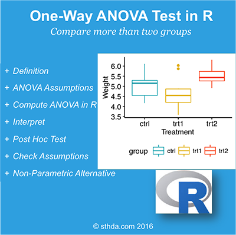

(@) ###What is one-way ANOVA test?

#
      The one-way analysis of variance (ANOVA), also known as one-factor ANOVA, 
      is an extension of independent two-samples t-test for comparing means in a situation 
      where there are more than two groups. 
      
      In one-way ANOVA, the data is organized into several groups base 
      on one single grouping variable (also called factor variable). 
    
+ ANOVA test hypotheses:
    - Null hypothesis         : the means of the different groups are the same
    - Alternative hypothesis  : At least one sample mean is not equal to the others.

#
    *Note* that,
      if you have only two groups, you can use t-test. 
      In this case the F-test and the t-test are equivalent.

<!-- {width=400px} -->

(@) ###Assumptions of ANOVA test

+ Here we describe the requirement for ANOVA test. 

+ ANOVA test can be applied only when :

#
      1. The observations are obtained independently and randomly from the population 
         defined by the factor levels.
      2. The data of each factor level are normally distributed.
      3. These normal populations have a common variance.
         (Levene’s test can be used to check this.)


(@) ###How one-way ANOVA test works?

+ Assume that we have 3 groups (A, B, C) to compare : 
1. Compute the common variance, which is called variance within samples ( $S^2_\text{within}$ ) or residual variance.
2. Compute the variance between sample means as follow:
   Compute the mean of each group
   Compute the variance between sample means ( $S^2_\text{between}$ )
3. Produce F-statistic as the ratio of $\frac{S^2_\text{between}}{S^2_\text{within}}$

#
      *Note* that, 
          a lower ratio (ratio < 1) indicates that there are no significant difference 
          between the means of the samples being compared.
          
          However, a higher ratio implies that the variation among group means are significant.


(@) ###Visualize your data and compute one-way ANOVA in R

+ ####Import your data into R

Here, we’ll use the built-in R data set named PlantGrowth. 
It contains the weight of plants obtained under a control and two different treatment conditions.

```{r eval=TRUE, include=TRUE, echo=TRUE, message=FALSE, warning=FALSE}
  my_data <- PlantGrowth
```


+ ####Check your data

To have an idea of what the data look like, we use the the function sample_n{dplyr}.  
The `sample_n{dplyr}` function randomly picks a few of the observations in the data frame to print out:

```{r eval=TRUE, include=TRUE, echo=TRUE, message=FALSE, warning=FALSE}
  # Show a random sample
  set.seed(1234)

  dplyr::sample_n(my_data, 10)
```

#
      In R terminology,
          the column “group” is called factor and the different categories (“ctr”, “trt1”, “trt2”) 
          are named factor levels. 
          
          The levels are ordered alphabetically.

```{r eval=TRUE, include=TRUE, echo=TRUE, message=FALSE, warning=FALSE}
  # Show the levels
  levels(my_data$group)
```

If the levels are not automatically in the correct order,
re-order them as follow :

```{r eval=TRUE, include=TRUE, echo=TRUE, message=FALSE, warning=FALSE}
  my_data$group <- ordered( my_data$group, levels = c("ctrl", "trt1", "trt2") )
```

It’s possible to compute summary statistics (mean and sd)
by groups using the `{dplyr}` package.

```{r eval=TRUE, include=TRUE, echo=TRUE, message=FALSE, warning=FALSE}
  library(dplyr)

  group_by(my_data, group) %>%
      summarise(
          count = n(),
          mean = mean(weight, na.rm = TRUE),
          sd = sd(weight, na.rm = TRUE)
      )
```


+ ####Visualize your data

```{r eval=TRUE, include=TRUE, echo=TRUE, message=FALSE, warning=FALSE}
  # Box plots
  # ++++++++++++++++++++

  # Plot weight by group and color by group
  library("ggpubr", quietly = TRUE)

  ggboxplot(my_data, 
            x = "group", 
            y = "weight", 
            color = "group", 
            palette = c("#00AFBB", "#E7B800", "#FC4E07"),
            order = c("ctrl", "trt1", "trt2"),
            ylab = "Weight", 
            xlab = "Treatment"
        )
  
  # Mean plots
  # ++++++++++++++++++++
  
  # Plot weight by group
  # Add error bars: mean_se
  # (other values include: mean_sd, mean_ci, median_iqr, ....)
  library("ggpubr", quietly = TRUE)
  
  ggline(my_data, 
         x = "group", 
         y = "weight", 
         add = c("mean_se", "jitter"), 
         order = c("ctrl", "trt1", "trt2"),
         ylab = "Weight", 
         xlab = "Treatment"
      )
```

If you still want to use R base graphs,
type the following scripts : 

```{r eval=TRUE, include=TRUE, echo=TRUE, message=FALSE, warning=FALSE}
  # Box plot
  boxplot(weight ~ group, 
          data = my_data,
          xlab = "Treatment", 
          ylab = "Weight",
          frame = FALSE, 
          col = c("#00AFBB", "#E7B800", "#FC4E07")
        )

  # plotmeans
  #install.packages('gplots', quiet = TRUE, dependencies = TRUE)
  library("gplots", quietly = TRUE)

  plotmeans(weight ~ group, 
            data = my_data, 
            frame = FALSE,
            xlab = "Treatment", 
            ylab = "Weight",
            main="Mean Plot with 95% CI"
          )
```


+ ####Compute one-way ANOVA test

#
      We want to know 
          if there is any significant difference 
          between the average weights of plants in the 3 experimental conditions.

The R function `aov{stats}` can be used to answer to this question. 
The function `summary.aov{stats}` is used to summarize the analysis of variance model.

```{r eval=TRUE, include=TRUE, echo=TRUE, message=FALSE, warning=FALSE}
  # Compute the analysis of variance
  res.aov <- aov(weight ~ group, data = my_data)

  # Summary of the analysis
  summary(res.aov)
```

#
      The output includes the columns F value and Pr(>F) corresponding to the p-value of the test.


+ ####Interpret the result of one-way ANOVA tests

#
      As the p-value is less than the significance level 0.05, 
      we can conclude that there are significant differences 
      between the groups highlighted with “*" in the model summary.


+ ####Multiple pairwise-comparison between the means of groups

In one-way ANOVA test, a significant p-value indicates that some of the group means are different,  
but we don’t know which pairs of groups are different.

It’s possible to perform multiple pairwise-comparison, to determine if the mean difference  
between specific pairs of group are statistically significant.


#####1. Tukey multiple pairwise-comparisons

As the ANOVA test is significant, we can compute `Tukey HSD` 
( Tukey Honest Significant Differences, R function: `TukeyHSD{stats}` ) 
for performing multiple pairwise-comparison between the means of groups.

The function `TukeyHSD{stats}` takes the fitted ANOVA as an argument.

```{r eval=TRUE, include=TRUE, echo=TRUE, message=FALSE, warning=FALSE}
  TukeyHSD(res.aov)
```

#
      1) diff     : difference between means of the two groups
      2) lwr, upr : the lower and the upper end point of the confidence interval at 95% (default)
      3) p adj    : p-value after adjustment for the multiple comparisons.

#
      It can be seen from the output, that only the difference between trt2 and trt1 is significant 
      with an adjusted p-value of 0.012.


#####2. Multiple comparisons using multcomp package

It’s possible to use the function `glht{multcomp}` to perform multiple comparison procedures for an ANOVA. `glht` stands for `general linear hypothesis tests`. The simplified format is as follow :

```{r eval=FALSE, include=TRUE, echo=TRUE, message=FALSE, warning=FALSE}
  glht(model, lincft)
```

#
      1) model    : a fitted model, for example an object returned by aov().
      2) lincft() : a specification of the linear hypotheses to be tested. 
                    Multiple comparisons in ANOVA models are specified by objects returned from the function mcp().

Use `glht{multicomp}` to perform multiple pairwise-comparisons for a one-way ANOVA:

```{r eval=TRUE, include=TRUE, echo=TRUE, message=FALSE, warning=FALSE}
  library(multcomp, quietly = TRUE)

  summary(glht(res.aov, linfct = mcp(group = "Tukey")))
```


#####3. Pairewise t-test

The function `pairewise.t.test{stats}` can be also used to calculate pairwise comparisons
between group levels with corrections for multiple testing.

```{r eval=TRUE, include=TRUE, echo=TRUE, message=FALSE, warning=FALSE}
  pairwise.t.test(my_data$weight, my_data$group, p.adjust.method = "BH")
```

The result is a table of p-values for the pairwise comparisons. 
Here, the p-values have been adjusted by the Benjamini-Hochberg method.


+ ####Check ANOVA assumptions: test validity ?

The ANOVA test assumes that, the data are normally distributed and the variance across groups are homogeneous. 

We can check that with some diagnostic plots.


#####1. Check the homogeneity of variance assumption

The residuals versus fits plot can be used to check the homogeneity of variances.

In the plot below, there is no evident relationships between residuals and fitted values
(the mean of each groups), which is good. 

So, we can assume the homogeneity of variances.

```{r eval=TRUE, include=TRUE, echo=TRUE, message=FALSE, warning=FALSE}
  # 1. Homogeneity of variances
  plot(res.aov, 1)
```

#
      Points 17, 15, 4 are detected as outliers, which can severely affect normality and homogeneity of variance. 
      It can be useful to remove outliers to meet the test assumptions.

#
      It’s also possible to use Bartlett’s test or Levene’s test to check the homogeneity of variances.


We recommend Levene’s test, which is less sensitive to departures from normal distribution.  
The function `leveneTest{car}` will be used:

```{r eval=TRUE, include=TRUE, echo=TRUE, message=FALSE, warning=FALSE}
  #install.packages('car', dependencies = TRUE, quiet = TRUE)
  library(car, quietly = TRUE)

  leveneTest(weight ~ group, data = my_data)
```

#
      From the output above, we can see that the p-value is not less than the significance level of 0.05.
      This means that there is no evidence to suggest that the variance across groups is 
      statistically significantly different. 
      
      Therefore, we can assume the homogeneity of variances in the different treatment groups.


#####2. Relaxing the homogeneity of variance assumption

The classical one-way ANOVA test requires an assumption of equal variances for all groups.
In our example, the homogeneity of variance assumption turned out to be fine : 
  the Levene test is not significant.

#
      How do we save our ANOVA test, 
      in a situation where the homogeneity of variance assumption is violated?

An alternative procedure (i.e.: Welch one-way test), that does not require that assumption have been implemented 
in the function `oneway.test()`.

  1) ANOVA test with no assumption of equal variances
  
```{r eval=TRUE, include=TRUE, echo=TRUE, message=FALSE, warning=FALSE}
  oneway.test(weight ~ group, data = my_data)
```
  
  2) Pairwise t-tests with no assumption of equal variances

```{r eval=TRUE, include=TRUE, echo=TRUE, message=FALSE, warning=FALSE}
  pairwise.t.test(my_data$weight, my_data$group, p.adjust.method = "BH", pool.sd = FALSE)
```


#####3. Check the normality assumption

**Normality plot of residuals**. In the plot below, the quantiles of the residuals are plotted against the quantiles of the normal distribution. 

A 45-degree reference line is also plotted.  

The normal probability plot of residuals is used to check the assumption that the residuals are normally distributed.  

It should approximately follow a straight line.

```{r eval=TRUE, include=TRUE, echo=TRUE, message=FALSE, warning=FALSE}
  # 2. Normality
  plot(res.aov, 2)
```

#
      As all the points fall approximately along this reference line, 
      we can assume normality.

The conclusion above, is supported by the Shapiro-Wilk test on the ANOVA residuals (W = 0.96, p = 0.6)  
which finds no indication that normality is violated.

```{r eval=TRUE, include=TRUE, echo=TRUE, message=FALSE, warning=FALSE}
  # Extract the residuals
  ( aov_residuals <- residuals(object = res.aov ) )

  # Run Shapiro-Wilk test
  shapiro.test(x = aov_residuals )
```


+ ####Non-parametric alternative to one-way ANOVA test

#
      Note that, a non-parametric alternative to one-way ANOVA is Kruskal-Wallis rank sum test,
      which can be used when ANNOVA assumptions are not met.

```{r eval=TRUE, include=TRUE, echo=TRUE, message=FALSE, warning=FALSE}
  kruskal.test(weight ~ group, data = my_data)
```


(@) ###Summary

+ Here, we used : `my_data <- PlantGrowth`.
+ Visualize your data : `ggpubr::ggboxplot(my_data, x = “group”, y = “weight”, color = “group”)`
+ Compute one-way ANOVA test : `summary( aov(weight ~ group, data = my_data) )`
+ Tukey multiple pairwise-comparisons : `TukeyHSD(res.aov)`

