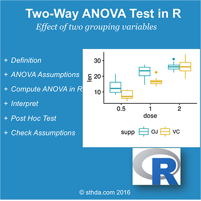

(@) ###What is **two-way ANOVA** test?

#
      Two-way ANOVA test is used to evaluate simultaneously the effect of two grouping variables (A and B)
      on a response variable.

The **grouping variables** are also known as **factors**.  
The **different categories** (groups) of a **factor** are called **levels**.  
The **number of levels** can **vary** between **factors**.
The **level combinations** of **factors** are called **cell**.  

#
      1) When the sample sizes within cells are "equal", we have the so-called "balanced design".
         In this case the "standard two-way ANOVA test" can be applied.

      2) When the "sample sizes" within "each level" of the "independent variables" are "not the same" 
         (case of unbalanced designs), the ANOVA test should be handled differently.

This tutorial describes how to compute **two-way ANOVA test** for **balanced** and **unbalanced** designs.

<!-- {width=400px} -->


(@) ###**Two-way ANOVA** test hypotheses

#
      1. There is no difference in the means of factor A
      2. There is no difference in the means of factor B
      3. There is no interaction between factors A and B

The **alternative** hypothesis for cases 1 and 2 is : the means are **not equal**.  
The **alternative** hypothesis for case 3 is        : there is an **interaction** between A and B.


(@) ###**Assumptions** of two-way ANOVA test

Two-way ANOVA, like all ANOVA tests, assumes that the **observations** within **each cell** are **normally distributed** and have **equal variances**. 

We’ll show you how to check these assumptions **after** fitting ANOVA.


(@) ###Compute two-way ANOVA test in R: **balanced designs**

#
      "Balanced designs"" correspond to the situation where we have "equal sample sizes" 
      within "levels" of our "independent grouping levels".

+ ####Import your data into R

Here, we’ll use the built-in R data set named `ToothGrowth{datasets}`.  
It contains data from a study evaluating the effect of **vitamin C** on **tooth growth** in **Guinea pigs**.  
The experiment has been performed on 60 pigs, where each animal received one of three dose levels of vitamin C
(0.5, 1, and 2 mg/day) by one of two delivery methods, orange juice or ascorbic acid (a form of vitamin C and coded as VC).

Tooth length was measured and a sample of the data is shown below.

```{r eval=TRUE, include=TRUE, echo=TRUE, message=FALSE, warning=FALSE}
  # Store the data in the variable my_data
  my_data <- ToothGrowth
```


+ ####Check your data

To get an idea of what the data look like, we display a random sample of the data using the function `sample_n{dplyr}`.

First, install dplyr if you don’t have it:

```{r eval=FALSE, include=TRUE, echo=TRUE, message=FALSE, warning=FALSE}
  install.packages("dplyr", dependencies = TRUE, quiet = TRUE)
```

```{r eval=TRUE, include=TRUE, echo=TRUE, message=FALSE, warning=FALSE}
  # Show a random sample
  set.seed(1234)

  dplyr::sample_n(my_data, 10)
  
  # Check the structure
  str(my_data)
```

#
      From the output above, R considers “dose” as a numeric variable.
      We’ll convert it as a factor variable (i.e., grouping variable) as follow.

```{r eval=TRUE, include=TRUE, echo=TRUE, message=FALSE, warning=FALSE}
  # Convert dose as a factor and recode the levels
  # as "D0.5", "D1", "D2"
  my_data$dose <- factor(
                      my_data$dose, 
                      levels = c(0.5, 1, 2),
                      labels = c("D0.5", "D1", "D2")
                  )

  head(my_data)
```

#
      Question: We want to know if tooth length depends on supp and dose.

Generate frequency tables :

```{r eval=TRUE, include=TRUE, echo=TRUE, message=FALSE, warning=FALSE}
  table(my_data$supp, my_data$dose)
```

#
      We have 2X3 design cells with the factors being supp and dose and 10 subjects in each cell.
      Here, we have a balanced design.
      
      In the next sections I’ll describe how to analyse data from balanced designs,
      since this is the simplest case.


+ ####Visualize your data

Box plots and line plots can be used to visualize group differences :

  1) Box plot to plot the data grouped by the combinations of the levels of the two factors.  
  2) Two-way interaction plot, which plots the mean (or other summary) of the response
     for two-way combinations of factors,  
     thereby illustrating possible interactions.
  3) To use R base graphs read this : R base graphs.   
     Here, we’ll use the ggpubr R package for an easy ggplot2-based data visualization.

Install the latest version of ggpubr from GitHub as follow (recommended):

```{r eval=FALSE, include=TRUE, echo=TRUE, message=FALSE, warning=FALSE}
  install.packages("ggpubr", dependencies = TRUE, quiet = TRUE)
```

```{r eval=TRUE, include=TRUE, echo=TRUE, message=FALSE, warning=FALSE}
  # Box plot with multiple groups
  # +++++++++++++++++++++

  # Plot tooth length ("len") by groups ("dose")
  # Color box plot by a second group: "supp"
  library("ggpubr", quietly = TRUE)

  ggboxplot(my_data, x = "dose", y = "len", color = "supp", palette = c("#00AFBB", "#E7B800"))
  
  
  # Line plots with multiple groups
  # +++++++++++++++++++++++
  
  # Plot tooth length ("len") by groups ("dose")
  # Color box plot by a second group: "supp"
  # Add error bars: mean_se
  # (other values include: mean_sd, mean_ci, median_iqr, ....)
  library("ggpubr", quietly = TRUE)
  
  ggline(my_data, 
         x = "dose", 
         y = "len", 
         color = "supp",
         add = c("mean_se", "dotplot"),
         palette = c("#00AFBB", "#E7B800")
      )
```

If you still want to use R base graphs, type the following scripts :

```{r eval=TRUE, include=TRUE, echo=TRUE, message=FALSE, warning=FALSE}
  # Box plot with two factor variables
  boxplot(len ~ supp * dose, 
          data=my_data,
          frame = FALSE, 
          col = c("#00AFBB", "#E7B800"),
          ylab="Tooth Length")

  # Two-way interaction plot
  interaction.plot(x.factor = my_data$dose, 
                   trace.factor = my_data$supp, 
                   response = my_data$len, 
                   fun = mean, 
                   type = "b", 
                   legend = TRUE, 
                   xlab = "Dose", 
                   ylab="Tooth Length",
                   pch=c(1,19), 
                   col = c("#00AFBB", "#E7B800"))
```

Arguments used for the function `interaction.plot{stats}` :

#
      1) x.factor     : the factor to be plotted on x axis.
      2) trace.factor : the factor to be plotted as lines
      3) response     : a numeric variable giving the response
      4) type         : the type of plot.
                        Allowed values include p (for point only), l (for line only) 
                        and b (for both point and line).


+ ####Compute two-way ANOVA test

#
      We want to know if tooth length depends on supp and dose.

The R function `aov{stats}` can be used to answer this question.  
The function `summary.aov{stats}` is used to summarize the analysis of variance model.

```{r eval=TRUE, include=TRUE, echo=TRUE, message=FALSE, warning=FALSE}
  res.aov2 <- aov(len ~ supp + dose, data = my_data)
  summary(res.aov2)
```

The output includes the columns F value and Pr(>F) corresponding to the p-value of the test.

#
      From the ANOVA table we can conclude that both supp and dose are statistically significant.
      dose is the most significant factor variable.
      
      These results would lead us to believe that changing delivery methods (supp) or the dose of vitamin C,
      will impact significantly the mean tooth length.

#
      Not the above fitted model is called additive model.
      It makes an assumption that the two factor variables are independent.
      
      If you think that these two variables might interact to create an synergistic effect,
      replace the plus symbol (+) by an asterisk (*), as follow.

```{r eval=TRUE, include=TRUE, echo=TRUE, message=FALSE, warning=FALSE}
  # Two-way ANOVA with interaction effect
  # These two calls are equivalent
  res.aov3 <- aov(len ~ supp * dose, data = my_data)
  res.aov3 <- aov(len ~ supp + dose + supp:dose, data = my_data)
  
  summary(res.aov3)
```

#
      It can be seen that the two main effects (supp and dose) are statistically significant,
      as well as their interaction.

#
      *Note* that, 
          in the situation where the interaction is not significant, you should use the additive model.


+ ####Interpret the results

From the ANOVA results, 
    you can conclude the following, based on the p-values and a significance level of 0.05:

1) the p-value of supp is 0.000429 (significant), which indicates that the levels of supp are associated with significant different tooth length.

2) the p-value of dose is < 2e-16 (significant), which indicates that the levels of dose are associated with significant different tooth length.

3) the p-value for the interaction between supp*dose is 0.02 (significant), which indicates that the relationships between dose and tooth length depends on the supp method.


+ ####Compute some summary statistics

Compute mean and SD by groups using `{dplyr}` R package :

```{r eval=TRUE, include=TRUE, echo=TRUE, message=FALSE, warning=FALSE}
  require("dplyr")

  group_by(my_data, supp, dose) %>%
      summarise(
          count = n(),
          mean = mean(len, na.rm = TRUE),
          sd = sd(len, na.rm = TRUE)
      )
```

It’s also possible to use the function model.tables() as follow:

```{r eval=TRUE, include=TRUE, echo=TRUE, message=FALSE, warning=FALSE}
  model.tables(res.aov3, type="means", se = TRUE)
```


+ ####Multiple pairwise-comparison between the means of groups

In ANOVA test, a significant p-value indicates that some of the group means are different,  
but we don’t know which pairs of groups are different.

It’s possible to perform multiple pairwise-comparison,  
to determine if the mean difference between specific pairs of group are statistically significant.


1. #####Tukey multiple pairwise-comparisons

As the ANOVA test is significant, we can compute Tukey HSD (Tukey Honest Significant Differences,  
R function: `TukeyHSD()`) for performing multiple pairwise-comparison between the means of groups.  
The function `TukeyHD()` takes the fitted ANOVA as an argument.

#
      We don’t need to perform the test for the “supp” variable because it has only two levels,
      which have been already proven to be significantly different by ANOVA test.
      
      Therefore, the Tukey HSD test will be done only for the factor variable “dose”.

```{r eval=TRUE, include=TRUE, echo=TRUE, message=FALSE, warning=FALSE}
  TukeyHSD(res.aov3, which = "dose")
```

#
      1) diff     : difference between means of the two groups
      2) lwr, upr : the lower and the upper end point of the confidence interval at 95% (default)
      3) p adj    : p-value after adjustment for the multiple comparisons.

#
      It can be seen from the output, that all pairwise comparisons are significant with an adjusted p-value < 0.05.


2. #####Multiple comparisons using multcomp package

It’s possible to use the function `glht{multcomp}` to perform multiple comparison procedures for an ANOVA. `glht` stands for `general linear hypothesis tests`.

The simplified format is as follow:

```{r eval=FALSE, include=TRUE, echo=TRUE, message=FALSE, warning=FALSE}
  # install.packages('multcomp', dependencies = TRUE, quiet = TRUE)
  library(multcomp, quietly = TRUE)

  glht(model, lincft)
```

#
      1) model    : a fitted model,
                    for example an object returned by aov().
      2) lincft() : a specification of the linear hypotheses to be tested.
                    Multiple comparisons in ANOVA models are specified by objects returned 
                    from the function mcp().

Use glht() to perform multiple pairwise-comparisons :

```{r eval=TRUE, include=TRUE, echo=TRUE, message=FALSE, warning=FALSE}
  library(multcomp, quietly = TRUE)

  summary( glht( res.aov2, linfct = mcp(dose = "Tukey") ) )
```


3. #####Pairwise t-test

The function `pairwise.t.test{stats}` can be also used to calculate pairwise comparisons  
between group levels with corrections for multiple testing.

```{r eval=TRUE, include=TRUE, echo=TRUE, message=FALSE, warning=FALSE}
  pairwise.t.test(my_data$len, my_data$dose, p.adjust.method = "BH")
```


+ ####Check ANOVA assumptions: test validity?

ANOVA assumes that the data are normally distributed and the variance across groups are homogeneous.
We can check that with some diagnostic plots.


1. #####Check the homogeneity of variance assumption

The residuals versus fits plot is used to check the homogeneity of variances.  
In the plot below, there is no evident relationships between residuals and fitted values  
(the mean of each groups), which is good.  

So, we can assume the homogeneity of variances.  

```{r eval=TRUE, include=TRUE, echo=TRUE, message=FALSE, warning=FALSE}
  # 1. Homogeneity of variances
  plot(res.aov3, 1)
```


2. #####Check the normality assumpttion

#
      Points 32 and 23 are detected as outliers, which can severely affect normality and homogeneity of variance.  
      It can be useful to remove outliers to meet the test assumptions.

Use the Levene’s test to check the homogeneity of variances.  
The function `leveneTest{car}` will be used:  

```{r eval=TRUE, include=TRUE, echo=TRUE, message=FALSE, warning=FALSE}
  library(car)

  leveneTest(len ~ supp*dose, data = my_data)
```

#
    From the output above we can see that the p-value is not less than the significance level of 0.05.
    This means that there is no evidence to suggest that the variance
    across groups is statistically significantly different.
    
    Therefore, we can assume the homogeneity of variances in the different treatment groups.

**Normality plot of the residuals**. 

In the plot below, the quantiles of the residuals are plotted against the quantiles of the normal distribution.  
A 45-degree reference line is also plotted.  

The normal probability plot of residuals is used to verify the assumption that the residuals are normally distributed.  
The normal probability plot of the residuals should approximately follow a straight line.  


```{r eval=TRUE, include=TRUE, echo=TRUE, message=FALSE, warning=FALSE}
  # 2. Normality
  plot(res.aov3, 2)
```

#
      As all the points fall approximately along this reference line, we can assume normality.
      
The conclusion above, is supported by the Shapiro-Wilk test on the ANOVA residuals (W = 0.98, p = 0.5)   
which finds no indication that normality is violated.

```{r eval=TRUE, include=TRUE, echo=TRUE, message=FALSE, warning=FALSE}
  # Extract the residuals
  ( aov_residuals <- residuals(object = res.aov3) )

  # Run Shapiro-Wilk test
  shapiro.test(x = aov_residuals )
```


(@) ###Compute two-way ANOVA test in R for unbalanced designs

An unbalanced design has unequal numbers of subjects in each group.  

There are three fundamentally different ways to run an ANOVA in an unbalanced design.  
They are known as Type-I, Type-II and Type-III sums of squares.  

To keep things simple, note that The recommended method are the Type-III sums of squares.  

#
      The three methods give the same result when the design is balanced.
      However, when the design is unbalanced, they don’t give the same results.
      
The function Anova() [in car package] can be used to compute two-way ANOVA test for unbalanced designs.
First install the package on your computer.

In R, type install.packages(“car”). Then:

```{r eval=TRUE, include=TRUE, echo=TRUE, message=FALSE, warning=FALSE}
  library(car)

  my_anova <- aov(len ~ supp * dose, data = my_data)
  Anova(my_anova, type = "III")
```

