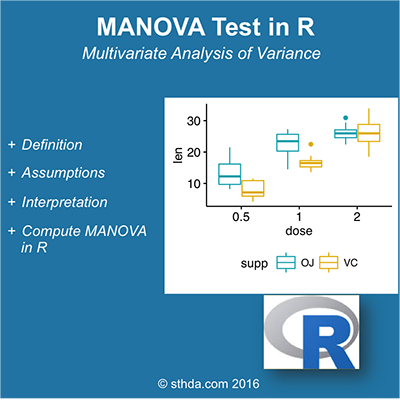

(@) ###What is **MANOVA** test?

#
      In the situation where there multiple response variables you can test them simultaneously 
      using a multivariate analysis of variance (MANOVA).  

For example, we may conduct an **experiment** where we give **two treatments** (A and B) to **two groups** of mice,  
and we are interested in the **weight** and **height** of mice.  

In that case, the **weight** and **height** of mice are **two dependent variables**, and our **hypothesis** is that  
**both** together are **affected** by the **difference** in **treatment**.  

A **multivariate analysis of variance** could be used to **test** this hypothesis.

<!-- {width=400px} -->


(@) ###Assumptions of **MANOVA**

**MANOVA** can be used in certain conditions:

  1) The **dependent variables** should be **normally distribute** within **groups**.
     The R function `mshapiro.test{mvnormtest}` can be used to perform the **Shapiro-Wilk test** for **multivariate normality**.
  2) This is useful in the case of **MANOVA**, which assumes **multivariate normality**.  
  3) **Homogeneity of variances** across the **range of predictors**.  
  4) **Linearity** between **all pairs** of **dependent variables**, **all pairs of covariates**,  
     and **all dependent variable-covariate pairs** in each cell


(@) ###Interpretation of **MANOVA**

If the **global multivariate test** is **significant**, we conclude that the **corresponding effect** (treatment) is **significant**.

In that case, the next question is to determine if the **treatment** affects **only** the weight, **only** the height or **both**.  
In other words, we want to **identify** the **specific dependent variables** that contributed to the **significant global effect**.

To answer this question, we can use **one-way ANOVA** (or **univariate ANOVA**) to examine **separately** **each dependent variable**.


(@) ###Compute **MANOVA**

+ ####Import your data into R

Here, we’ll use `iris{datasets}` data set :

```{r eval=TRUE, include=TRUE, echo=TRUE, message=FALSE, warning=FALSE}
  # Store the data in the variable my_data
  my_data <- iris
```


+ ####Check your data

The R code below display a **random sample** of our data using the function `sample_n{dplyr}`.  
First, install `{dplyr}` if you don’t have it:

```{r eval=TRUE, include=TRUE, echo=TRUE, message=FALSE, warning=FALSE}
  # Show a random sample
  set.seed(1234)

  dplyr::sample_n(my_data, 10)
```

#
      Question: We want to know if there is any significant difference, in sepal and petal length, 
                between the different species.


+ ####Compute **MANOVA** test

The function `manova{stats}` can be used as follow :

```{r eval=TRUE, include=TRUE, echo=TRUE, message=FALSE, warning=FALSE}
  sepl <- iris$Sepal.Length
  petl <- iris$Petal.Length
  
  # MANOVA test
  res.man <- manova(cbind(Sepal.Length, Petal.Length) ~ Species, data = iris)
  summary(res.man)
  
  # Look to see which differ
  summary.aov(res.man)
```

#
      From the output above, 
      it can be seen that the two variables are highly significantly different among Species.


