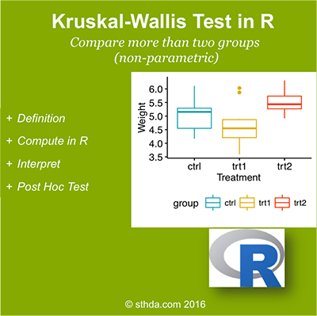

+ ###This chapter describes statistical tests to use for comparing means.

- ###These tests include:  
    (1) T-test  
    (2) Wilcoxon test  
    (3) ANOVA test and  
    (4) Kruskal-Wallis test  
    
(@) ###How this chapter is organized?

#
        1. Comparing one-sample mean to a standard known mean:
            (1) One-Sample T-test (parametric)
            (2) One-Sample Wilcoxon Test (non-parametric)
          
        2. Comparing the means of two independent groups:
            (1) Unpaired Two Samples T-test (parametric)
            (2) Unpaired Two-Samples Wilcoxon Test (non-parametric)
            
        3. Comparing the means of paired samples:
            (1) Paired Samples T-test (parametric)
            (2) Paired Samples Wilcoxon Test (non-parametric)
            
        4. Comparing the means of more than two groups
            (1) Analysis of variance (ANOVA, parametric):
                - One-Way ANOVA Test in R
                - Two-Way ANOVA Test in R
                - MANOVA Test in R: Multivariate Analysis of Variance
            (2) Kruskal-Wallis Test in R (non-parametric alternative to one-way ANOVA)

(@) ###Comparing one-sample mean to a standard known mean

+ ####One-sample T-test ( $\color{red}{parametric}$ )

    + brief outlines:
        - What is one-sample t-test?
        - Research questions and statistical hypotheses
        - Formula of one-sample t-test
        - Visualize your data and compute one-sample t-test in R
            - R function to compute one-sample t-test
            - Visualize your data using box plots
            - Preliminary test to check one-sample t-test assumptions
            - Compute one-sample t-test
            - Interpretation of the result
            
<!--              -->

***

+ ####One-sample Wilcoxon test ( $\color{blue}{non-parametric}$ )

    + brief outlines:
        - What’s one-sample Wilcoxon signed rank test?
        - Research questions and statistical hypotheses
        - Visualize your data and compute one-sample Wilcoxon test in R
            - R function to compute one-sample Wilcoxon test
            - Visualize your data using box plots
            - Compute one-sample Wilcoxon test
            
<!--            -->

(@) ###Comparing the means of two independent groups

+ ####Unpaired two samples t-test ( $\color{red}{parametric}$ )

    + brief outlines:
        - What is unpaired two-samples t-test?
        - Research questions and statistical hypotheses
        - Formula of unpaired two-samples t-test
        - Visualize your data and compute unpaired two-samples t-test in R
        - R function to compute unpaired two-samples t-test
        - Visualize your data using box plots
        - Preliminary test to check independent t-test assumptions
        - Compute unpaired two-samples t-test
        - Interpretation of the result
        
<!--  -->

***

+ ####Unpaired two-samples Wilcoxon test ( $\color{blue}{non-parametric}$ )

    + brief outlines:
        - R function to compute Wilcoxon test
        - Visualize your data using box plots
        - Compute unpaired two-samples Wilcoxon test
        
<!--  -->

(@) ###Comparing the means of paired samples

+ ####Paired samples t-test ( $\color{red}{parametric}$ )

<!-- {width=400px} -->

***

+ ####Paired samples Wilcoxon test ( $\color{blue}{non-parametric}$ )

<!-- {width=400px} -->

(@) ###Comparing the means of more than two groups

+ ####One-way ANOVA test ( $\color{red}{parametric}$ )  
    - An extension of independent two-samples t-test for comparing means 
      in a situation where there are more than two groups.
      
    - brief outlines:
        - What is one-way ANOVA test?
        - Assumptions of ANOVA test
        - How one-way ANOVA test works?
        - Visualize your data and compute one-way ANOVA in R
        - Visualize your data
        - Compute one-way ANOVA test
        - Interpret the result of one-way ANOVA tests
        - Multiple pairwise-comparison between the means of groups
        - Tukey multiple pairewise-comparisons
        - Multiple comparisons using multcomp package
        - Pairwise t-test
        - Check ANOVA assumptions: test validity?
        - Check the homogeneity of variance assumption
        - Relaxing the homogeneity of variance assumption
        - Check the normality assumption
        - Non-parametric alternative to one-way ANOVA test  
        
<!-- {width=400px} -->

***  

+ ####Two-Way ANOVA test ( $\color{red}{parametric}$ )
    - brief outlines:
        - What is two-way ANOVA test?
        - Two-way ANOVA test hypotheses
        - Assumptions of two-way ANOVA test
        - Compute two-way ANOVA test in R: balanced designs
        - Visualize your data
        - Compute two-way ANOVA test
        - Interpret the results
        - Compute some summary statistics
        - Multiple pairwise-comparison between the means of groups
        - Tukey multiple pairewise-comparisons
        - Multiple comparisons using multcomp package
        - Pairwise t-test
        - Check ANOVA assumptions: test validity?
        - Check the homogeneity of variance assumption
        - Check the normality assumption
        - Compute two-way ANOVA test in R for unbalanced designs
        
<!-- {width=400px} -->

***

+ ####MANOVA test: Multivariate analysis of variance ( $\color{red}{parametric}$ )

    - brief outlines:
        + What is MANOVA test?
        + Assumptions of MANOVA
        + Interpretation of MANOVA
        + Compute MANOVA in R

<!-- {width=400px} -->

(@) ###Kruskal-Wallis test ( $\color{blue}{non-parametric}$ )

+ brief outlines:
    - What is Kruskal-Wallis test?
    - Visualize your data and compute Kruskal-Wallis test in R
        - Visualize the data using box plots
        - Compute Kruskal-Wallis test
        - Multiple pairwise-comparison between groups
        
<!-- {width=400px} -->